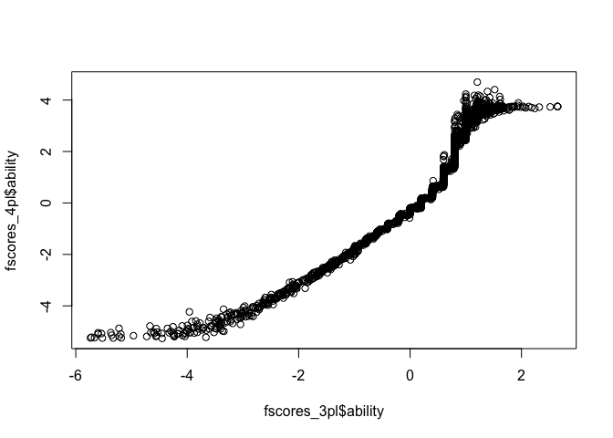
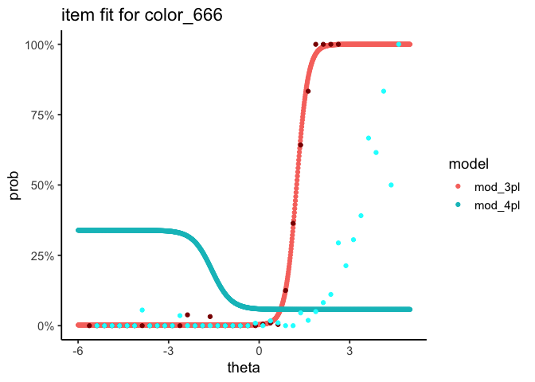

1\_ben\_milestones\_3pl\_vs\_4pl
================

# Prepare data

``` r
# read in
fix_names <- function(x) ifelse(x == "", paste0("X__", 1:length(x) - 1), x)

d_raw <- 
  readxl::read_xlsx(
    "data/norming2/Kinedu Norming Survey Raw Data - May 15 2018.xlsx", 
    .name_repair = fix_names
  )

# prepare irt matrix
d <- 
  d_raw %>%
  mutate(age = as.numeric(X__422), 
         gestation = as.numeric(X__3),
         kinder = as.numeric(X__4),
         diagnosis = as.numeric(X__1), 
         id = `Nombre variable`) %>%
  slice(4:n()) %>% # drop two top label rows. 
  select(-starts_with("X"), -`Nombre variable`) %>%
  gather(code, response, abs_183:color_679) %>%
  mutate(code = str_replace(code, "^d_","d"),
         code = str_replace(code, "^e_",""),
         code2 = code) %>%
  separate(code2, into = c("category","number")) %>%
  select(-number) %>%
  mutate(response = as.numeric(response)) %>% 
  filter(age != 0) # DROP AGE 0
```

    ## Warning: NAs introduced by coercion
    
    ## Warning: NAs introduced by coercion
    
    ## Warning: NAs introduced by coercion
    
    ## Warning: NAs introduced by coercion

``` r
d_wide <- d %>%
  select(id, code, response) %>%
  spread(code, response)
  
d_mat <- d_wide %>%
  select(-id) %>% 
  data.frame %>%
  data.matrix

colnames(d_mat) <- sort(unique(d$code))
rownames(d_mat) <- d_wide$id

# lots of items / students is relatively high
dim(d_mat)
```

    ## [1] 1981  414

# Should we use the 3PL or the 4PL?

## Estimate models

Fit models

``` r
mod_3pl <- mirt(d_mat, 1, itemtype='3PL', verbose=FALSE, TOL = 0.0001)
mod_4pl <- mirt(d_mat, 1, itemtype='4PL', verbose=FALSE, TOL = 0.00000001)
```

Bizarre that the more flexible 4pl has a less probable likelihood

``` r
mod_3pl@Fit$logLik
```

    ## [1] -224006.8

``` r
mod_4pl@Fit$logLik
```

    ## [1] -250768.9

## Ability

Abilities correlate highly between the two models with the expected
ceiling on ability imposed by the 4pl model.

``` r
fscores_3pl <-
    tibble(
        id = rownames(d_mat), 
        ability = fscores(mod_3pl, method = "EAP")[ , 1]
    )

fscores_4pl <- 
    tibble(
        id = rownames(d_mat), 
        ability = fscores(mod_4pl, method = "EAP")[ , 1]
    )

plot(fscores_3pl$ability, fscores_4pl$ability)
```

<!-- -->

## Items

Clean up coefficients

``` r
coef_3pl <- 
    coef(mod_3pl, simplify = TRUE)$items %>% 
    as.data.frame() %>% 
    mutate(item = row.names(.)) %>% 
    as_tibble()

coef_4pl <- 
    coef(mod_4pl, simplify = TRUE)$items %>% 
    as.data.frame() %>% 
    mutate(item = row.names(.)) %>% 
    as_tibble()
```

Find items with low upper bounds. These will be the items the 3PL and
4PL disagree most on.

``` r
coef_4pl_low_u <- 
    coef_4pl %>% 
    arrange(u) %>% 
    filter(u < 0.5) %>% 
    print()
```

    ## # A tibble: 6 x 5
    ##      a1     d      g     u item       
    ##   <dbl> <dbl>  <dbl> <dbl> <chr>      
    ## 1 -3.38 -4.35 0.117  0.291 indep_673  
    ## 2 -4.08 -5.21 0.0328 0.321 color_679  
    ## 3 -3.15 -4.95 0.0576 0.339 color_666  
    ## 4 -2.63 -4.71 0.0863 0.348 finger_532 
    ## 5 -1.96 -4.43 0.121  0.379 problem_669
    ## 6 -2.00 -4.89 0.0790 0.415 color_677

``` r
coef_3pl %>% filter(item %in% coef_4pl_low_u$item)
```

    ## # A tibble: 6 x 5
    ##      a1     d         g     u item       
    ##   <dbl> <dbl>     <dbl> <dbl> <chr>      
    ## 1  5.30 -6.59 0.00238       1 color_666  
    ## 2  5.56 -6.44 0.00441       1 color_677  
    ## 3  4.84 -6.82 0.00337       1 color_679  
    ## 4  3.90 -4.72 0.0000271     1 finger_532 
    ## 5  2.37 -3.14 0.00482       1 indep_673  
    ## 6  3.24 -3.74 0.000659      1 problem_669

So, which model is right?

## Manually look at item fit

Select an item to work with

``` r
# this is "Draw a person with at least two body parts"
item <- "color_666"
```

Look at performance on that item by bucket

``` r
midcut <- function(x, from, to, by){
   x <- cut(x,seq(from,to,by),include.lowest=T)
   vec <- seq(from+by/2,to-by/2,by)
   names(vec) <- levels(x)
   unname(vec[x])
}

ability_and_item <- 
    tibble(
        theta_3pl = fscores_3pl$ability,
        theta_4pl = fscores_4pl$ability,
        correct = d_mat[ , item]
    ) %>% 
    mutate(
        theta_3pl_bucket = midcut(theta_3pl, -6, 5, 0.25),
        theta_4pl_bucket = midcut(theta_4pl, -6, 5, 0.25)
    )

buckets_3pl <- 
    ability_and_item %>% 
    group_by(theta_3pl_bucket) %>% 
    summarize(
        p_correct = mean(correct),
        n = n()
    )

buckets_4pl <- 
    ability_and_item %>% 
    group_by(theta_4pl_bucket) %>% 
    summarize(
        p_correct = mean(correct),
        n = n()
    )
```

Pick an item and compare the item response curves

``` r
crossing(
    model = c("mod_3pl", "mod_4pl"),
    theta = seq(-6, 5, length.out = 1000)
) %>% 
    # plot probability from the models
    mutate(
        prob = 
            map2_dbl(
                model, 
                theta, 
                ~ probtrace(
                    extract.item(
                        get(.x), 
                        which(coef_3pl$item == item)
                    ), 
                    .y
                )[2]
            )
    ) %>% 
    ggplot(aes(x = theta, y = prob, color = model)) +
    geom_point(alpha = 1) +
    # empirical 3pl
    geom_point(
        data = buckets_3pl,
        aes(
            x = theta_3pl_bucket,
            y = p_correct
        ),
        color = "darkred"
    ) +
    # empirical 4pl
    geom_point(
        data = buckets_4pl,
        aes(
            x = theta_4pl_bucket,
            y = p_correct
        ),
        color = "cyan"
    ) +
    labs(title = paste0("item fit for ", item)) +
    scale_y_continuous(labels = scales::percent)
```

<!-- -->
